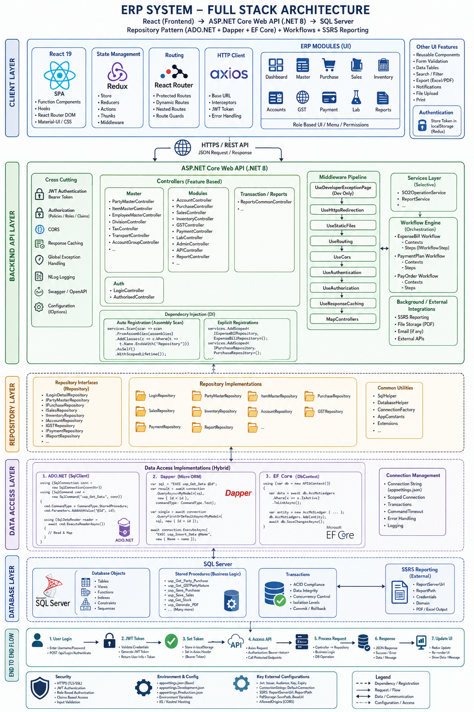

# ERP System - Full Stack Architecture Reference Blueprint

An enterprise-grade, high-scale 3-tier **Modular Monolithic** architectural reference blueprint designed for modernized ERP environments. This reference model seamlessly bridges client interaction, business logic orchestration, and optimized hybrid data access layers.

## 📊 Architecture Visual Chart

---

## 🛠️ Core Architectural Framework

### 1. Client Layer (React UI)
* **Framework:** React 19 utilizing functional components, custom hooks, and modern lifecycle standards.
* **State Management:** Redux (with Redux Thunk middleware for asynchronous API lifecycle actions).
* **Routing & Client-Side Security:** Protected and dynamic routes utilizing client-side route guards.
* **HTTP Client:** Axios featuring global request/response interceptors, automated JWT token injection, and structured error boundaries.

### 2. Backend Layer (ASP.NET Core Web API - .NET 8)
* **Cross-Cutting Concerns:** Built-in JWT Bearer authentication, Role-Based Access Control (RBAC), global exception filters, NLog structured logging, and automated OpenAPI/Swagger API contracts.
* **Dependency Injection (DI):** Automated assembly scanning and convention-based registration (`AddClasses().AsMatchingInterface()`).
* **Middleware Pipeline:** Strictly ordered processing pipeline (HTTPS redirection, Static Files, Routing, CORS, Auth, Response Caching, and Controller Endpoints).
* **Business Logic & Workflow Engine:** Decoupled Services Layer and dedicated Workflow Engines for discrete transaction state orchestrations (e.g., Expense Bill, Payment Plan, PayOrder workflows).

### 3. Repository & Data Access Layer (Hybrid DAL)
To balance rapid feature development with high-throughput database interactions, the platform implements a specialized **Hybrid Data Access Layer**:
* **Entity Framework Core (EF Core):** Utilized for complex write operations, transactional database modeling, explicit migrations, and selective LINQ query expressions.
* **Dapper (Micro-ORM):** Engineered for ultra-high-performance read operations, executing highly optimized raw SQL queries, asynchronous multi-mapping, and complex stored procedures.
* **ADO.NET (SqlClient):** Deployed for low-level, high-speed transactional blocks requiring granular command control (`SqlDataReader`, `ExecuteReaderAsync`).

---

## ⚖️ License
This project is licensed under the MIT License - see the [LICENSE](LICENSE) file for details.
